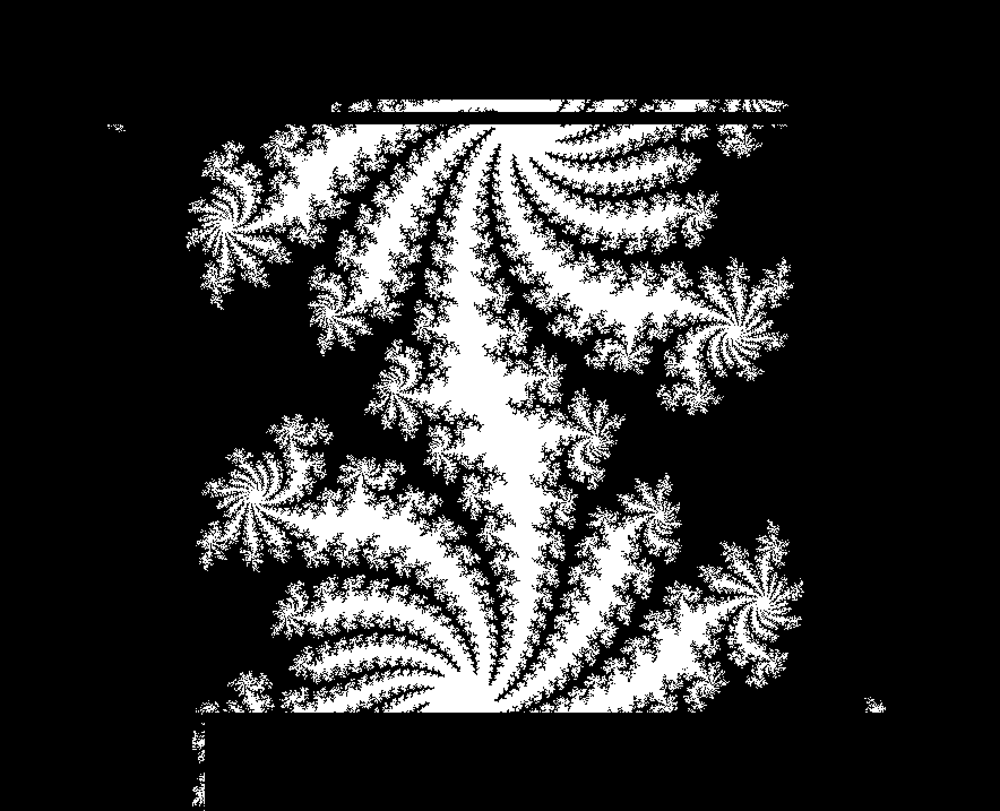
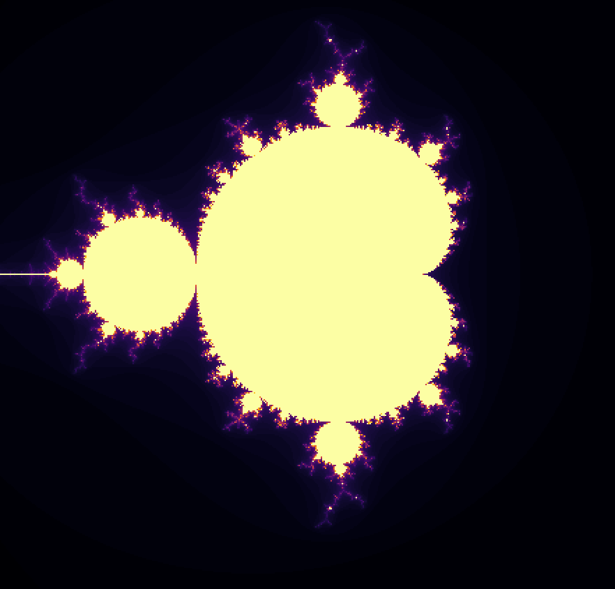
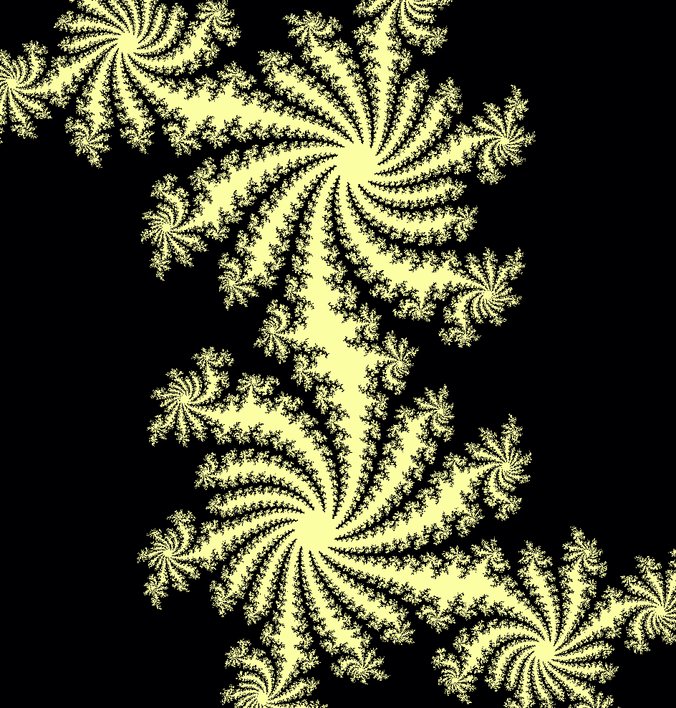

# APP-FractalProject
# Fractal Generator with OpenMP and MPI

This project generates a fractal images using parallel processing, then converts the raw binary output into a colorful PNG image using Python.

---

## Output Sample

After execution, the project produces a visually stunning fractal image.



---

## How It Works

### MPI

1. The C program (`fractal_mpi`) generates a raw grayscale image of the fractal and writes it to a binary output file.
2. A Python script (`render_fractal.py`) reads the output and maps grayscale values to color using a colormap.
3. The result is saved as `fractal.png`.
4. Use commad in `complie_mpi_command.sh` to generate a binary output file.


### Open-MP

1. The C program (`fractal_openmp`) generates a raw grayscale image of the fractal and writes it to a binary output file.
2. A Python script (`render_openmp.py`) reads the output and maps grayscale values to color using a colormap.
3. The result is saved as `openmp.png`.
4. Use commad in `complie_mpi_command.sh` to generate a binary output file.



### Open-MP and MPI Combo

1. The C program (`fractal_mpi_openmp_combo`) generates a raw grayscale image of the fractal and writes it to a binary output file.
2. A Python script (`render_fractal.py`) reads the output and maps grayscale values to color using a colormap.
3. The result is saved as `fractal.png`.
4. Use commad in `complie_combo_command.sh` to generate a binary output file.




---

## Requirements

### C Program
- MPICC with MPI support
- GCC with OpenMP support

### Python Script
- Python 3
- NumPy
- Matplotlib

To install Python dependencies:
```bash
pip install numpy matplotlib PIL
