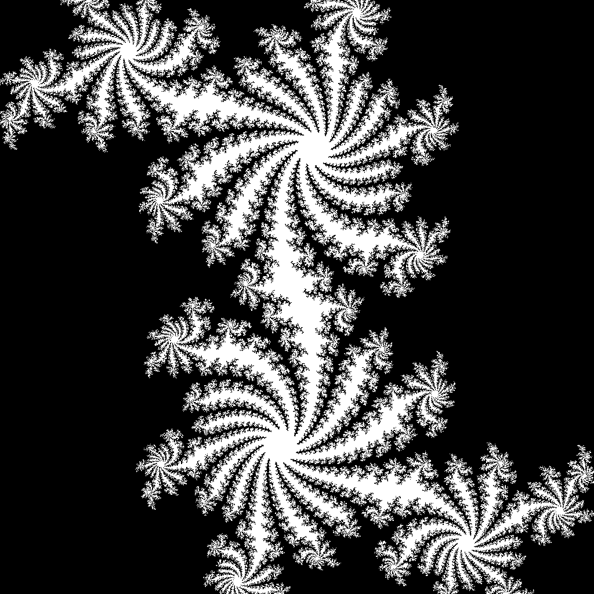

# APP-FractalProject
# Fractal Generator with OpenMP and MPI

This project generates a fractal images using parallel processing, then converts the raw binary output into a colorful PNG image using Python.

---

## Output Sample

After execution, the project produces a visually stunning fractal image.



---

## How It Works

### MPI

1. The C program (`fractal_mpi`) generates a raw grayscale image of the fractal and writes it to a binary output file.
2. A Python script (`render_fractal.py`) reads the output and maps grayscale values to color using a colormap.
3. The result is saved as `fractal.png`.
4. Use command in `compile_mpi_command.sh` to generate a binary output file.


### Open-MP

1. The C program (`fractal_openmp`) generates a raw grayscale image of the fractal and writes it to a binary output file.
2. A Python script (`render_openmp.py`) reads the output and maps grayscale values to color using a colormap.
3. The result is saved as `openmp.png`.
4. Use command in `compile_mpi_command.sh` to generate a binary output file.


### Open-MP Julia Fractal
1. The C program (`fractal_openmp_julia`) generates a raw grayscale image of the fractal and writes it to a binary output file.
2. A Python script (`render_fractal.py`) reads the output and maps grayscale values to color using a colormap.
3. The result is saved as `fractal.png`.
4. Use command in `compile_openmp_julia.sh` to generate a binary output file.


### Open-MP and MPI Combo

1. The C program (`fractal_mpi_openmp_combo`) generates a raw grayscale image of the fractal and writes it to a binary output file.
2. A Python script (`render_fractal.py`) reads the output and maps grayscale values to color using a colormap.
3. The result is saved as `fractal.png`.
4. Use command in `compile_combo_command.sh` to generate a binary output file.


---
## Timing Results

### MPI
```
Time for all 2 threads to finish computing fractal of size (256, 256): 1.698441 seconds
Time for all 4 threads to finish computing fractal of size (256, 256): 1.613785 seconds
Time for all 6 threads to finish computing fractal of size (256, 256): 2.066248 seconds
Time for all 8 threads to finish computing fractal of size (256, 256): 2.044871 seconds
Time for all 12 threads to finish computing fractal of size (256, 256): 1.545843 seconds

Time for all 2 threads to finish computing fractal of size (1024, 1024): 4.653022 seconds
Time for all 4 threads to finish computing fractal of size (1024, 1024): 3.416313 seconds
Time for all 6 threads to finish computing fractal of size (1024, 1024): 3.081633 seconds
Time for all 8 threads to finish computing fractal of size (1024, 1024): 2.717364 seconds
Time for all 12 threads to finish computing fractal of size (1024, 1024): 2.390992 seconds

Time for all 2 threads to finish computing fractal of size (2048, 2048): 14.111769 seconds
Time for all 4 threads to finish computing fractal of size (2048, 2048): 9.079391 seconds
Time for all 6 threads to finish computing fractal of size (2048, 2048): 6.715357 seconds
Time for all 8 threads to finish computing fractal of size (2048, 2048): 6.358247 seconds
Time for all 12 threads to finish computing fractal of size (2048, 2048): 4.728300 seconds

Time for all 2 threads to finish computing fractal of size (4096, 4096): 51.475383 seconds
Time for all 4 threads to finish computing fractal of size (4096, 4096): 26.338970 seconds
Time for all 6 threads to finish computing fractal of size (4096, 4096): 19.360955 seconds
Time for all 8 threads to finish computing fractal of size (4096, 4096): 16.513354 seconds
Time for all 12 threads to finish computing fractal of size (4096, 4096): 12.905047 seconds

Time for all 2 threads to finish computing fractal of size (16384, 16384): 807.719501 seconds
Time for all 4 threads to finish computing fractal of size (16384, 16384): 388.379893 seconds
Time for all 6 threads to finish computing fractal of size (16384, 16384): 260.146825 seconds
Time for all 8 threads to finish computing fractal of size (16384, 16384): 194.796909 seconds
Time for all 12 threads to finish computing fractal of size (16384, 16384): 135.563234 seconds
```

### OpenMP Julia
```
Time for all 2 threads to finish computing fractal of size (256, 256): 0.201953 seconds
Time for all 4 threads to finish computing fractal of size (256, 256): 0.115242 seconds
Time for all 6 threads to finish computing fractal of size (256, 256): 0.083632 seconds
Time for all 8 threads to finish computing fractal of size (256, 256): 0.071317 seconds
Time for all 12 threads to finish computing fractal of size (256, 256): 0.050952 seconds

Time for all 2 threads to finish computing fractal of size (1024, 1024): 3.145890 seconds
Time for all 4 threads to finish computing fractal of size (1024, 1024): 1.793473 seconds
Time for all 6 threads to finish computing fractal of size (1024, 1024): 1.295958 seconds
Time for all 8 threads to finish computing fractal of size (1024, 1024): 1.113819 seconds
Time for all 12 threads to finish computing fractal of size (1024, 1024): 0.762266 seconds

Time for all 2 threads to finish computing fractal of size (2048, 2048): 12.532413 seconds
Time for all 4 threads to finish computing fractal of size (2048, 2048): 7.169590 seconds
Time for all 6 threads to finish computing fractal of size (2048, 2048): 5.191536 seconds
Time for all 8 threads to finish computing fractal of size (2048, 2048): 4.452035 seconds
Time for all 12 threads to finish computing fractal of size (2048, 2048): 3.047806 seconds

Time for all 2 threads to finish computing fractal of size (4096, 4096): 50.131954 seconds
Time for all 4 threads to finish computing fractal of size (4096, 4096): 28.617310 seconds
Time for all 6 threads to finish computing fractal of size (4096, 4096): 20.778292 seconds
Time for all 8 threads to finish computing fractal of size (4096, 4096): 17.839281 seconds
Time for all 12 threads to finish computing fractal of size (4096, 4096): 12.182618 seconds

Time for all 2 threads to finish computing fractal of size (16384, 16384): 799.956105 seconds
Time for all 4 threads to finish computing fractal of size (16384, 16384): 457.498309 seconds
Time for all 6 threads to finish computing fractal of size (16384, 16384): 332.152815 seconds
Time for all 8 threads to finish computing fractal of size (16384, 16384): 284.964077 seconds
Time for all 12 threads to finish computing fractal of size (16384, 16384): 194.629581 seconds
```

### MPI and OpenMP
```
Time for all 2 MPI and 2 OpenMP threads to finish computing fractal of size (256, 256): 1.618154 seconds
Time for all 2 MPI and 4 OpenMP threads to finish computing fractal of size (256, 256): 1.111958 seconds
Time for all 2 MPI and 6 OpenMP threads to finish computing fractal of size (256, 256): 1.112739 seconds
Time for all 4 MPI and 2 OpenMP threads to finish computing fractal of size (256, 256): 0.567477 seconds
Time for all 4 MPI and 3 OpenMP threads to finish computing fractal of size (256, 256): 2.052237 seconds
Time for all 6 MPI and 2 OpenMP threads to finish computing fractal of size (256, 256): 2.039177 seconds

Time for all 2 MPI and 2 OpenMP threads to finish computing fractal of size (1024, 1024): 3.295721 seconds
Time for all 2 MPI and 4 OpenMP threads to finish computing fractal of size (1024, 1024): 2.770128 seconds
Time for all 2 MPI and 6 OpenMP threads to finish computing fractal of size (1024, 1024): 2.778038 seconds
Time for all 4 MPI and 2 OpenMP threads to finish computing fractal of size (1024, 1024): 2.853153 seconds
Time for all 4 MPI and 3 OpenMP threads to finish computing fractal of size (1024, 1024): 1.844568 seconds
Time for all 6 MPI and 2 OpenMP threads to finish computing fractal of size (1024, 1024): 2.634926 seconds

Time for all 2 MPI and 2 OpenMP threads to finish computing fractal of size (2048, 2048): 8.628366 seconds
Time for all 2 MPI and 4 OpenMP threads to finish computing fractal of size (2048, 2048): 8.543024 seconds
Time for all 2 MPI and 6 OpenMP threads to finish computing fractal of size (2048, 2048): 8.572832 seconds
Time for all 4 MPI and 2 OpenMP threads to finish computing fractal of size (2048, 2048): 5.221747 seconds
Time for all 4 MPI and 3 OpenMP threads to finish computing fractal of size (2048, 2048): 5.591425 seconds
Time for all 6 MPI and 2 OpenMP threads to finish computing fractal of size (2048, 2048): 4.670881 seconds

Time for all 2 MPI and 2 OpenMP threads to finish computing fractal of size (4096, 4096): 29.823836 seconds
Time for all 2 MPI and 4 OpenMP threads to finish computing fractal of size (4096, 4096): 29.605047 seconds
Time for all 2 MPI and 6 OpenMP threads to finish computing fractal of size (4096, 4096): 29.701348 seconds
Time for all 4 MPI and 2 OpenMP threads to finish computing fractal of size (4096, 4096): 17.138471 seconds
Time for all 4 MPI and 3 OpenMP threads to finish computing fractal of size (4096, 4096): 17.982249 seconds
Time for all 6 MPI and 2 OpenMP threads to finish computing fractal of size (4096, 4096): 12.720041 seconds

Time for all 2 MPI and 2 OpenMP threads to finish computing fractal of size (16384, 16384): 451.503855 seconds
Time for all 2 MPI and 4 OpenMP threads to finish computing fractal of size (16384, 16384): 449.851145 seconds
Time for all 2 MPI and 6 OpenMP threads to finish computing fractal of size (16384, 16384): 450.319832 seconds
Time for all 4 MPI and 2 OpenMP threads to finish computing fractal of size (16384, 16384): 257.583034 seconds
Time for all 4 MPI and 3 OpenMP threads to finish computing fractal of size (16384, 16384): 230.083455 seconds
Time for all 6 MPI and 2 OpenMP threads to finish computing fractal of size (16384, 16384): 148.780544 seconds
```

MPI on its own shows the best scaling, with larger problems that benefit from more threads the time reduction scales somewhat linearly with amount of threads. Meanwhile OpenMP's scaling is similar
but still lags behind that of MPI for much larger problems. Surprisingly, the MPI and OpenMP combination shows the worst results of all, despite the fact that it should be more effective.
Likely the different intercommunication types adding up to a larger overhead than either on their own.

The reason this problem does scale so well regardless of framework chosen however, is because the problem of generating fractals is perfectly parallel. Each step/pixel is reliant only upon itself.
Causing the bulk of the program (ie. anything that's not setup, shutdown, and file writing) to scale linearly. Meaning that a fractal generating problem doesn't suffer from the usual problems of
Amdahl's law. If we had time we would have investigated using the GPU for this problem as well, with the expectation it would easily beat out any other form with no contest due to the aforementioned
properties.

---

## Requirements

### C Program
- MPICC with MPI support
- GCC with OpenMP support

### Python Script
- Python 3
- NumPy
- Matplotlib

To install Python dependencies:
```bash
pip install numpy matplotlib PIL
